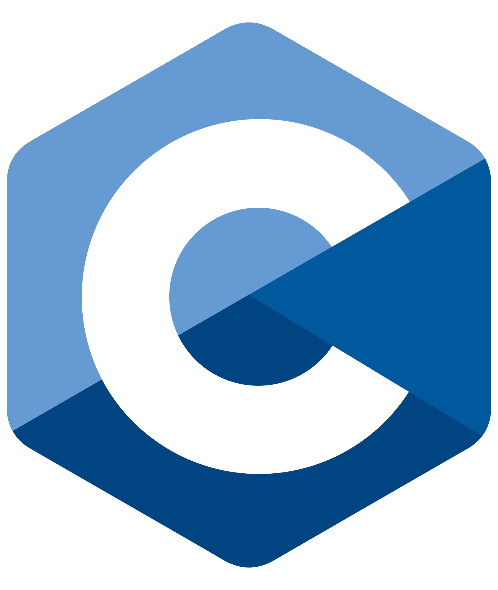
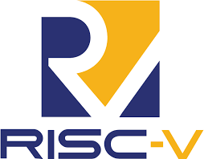

# Hi there, I'm Kaiden! 👋

Currently an EE (SoC subgroup) graduate at NSYSU, Taiwan.

## Education

- 🏫 **M.S.**: [Electrical Engineering (SoC subgroup) @ NSYSU, Taiwan](https://web.ee.nsysu.edu.tw/p/412-1203-11592.php?Lang=zh-tw) ([System Co-Design Lab](https://system-co-design-lab.github.io/scdlab/))
    - ***research focus***: combine system co-design, FPGA acceleration, digital IC design with biomedical and scientific applications
    - ***tools***: Gem5, Verilator, RISC-V, Xilinx Alveo U55c FPGA Accelerator Card
    - ***keywords***: domain specific architecuture (DSA), electronic system level (ESL), digital IC design, FPGA prototyping, system co-design, hardware-software co-design, HBM
- 🏫 **B.S.**: [Computer Science (AI subgroup) @ NCCU, Taiwan](https://www.cs.nccu.edu.tw/web/index/index.jsp?lang=en)
    - *** research focus***: AI model architecture optimization, CV applications
    - 2 published conference papers:
        - [An Improved Spatial Transformer Network based on Lightweight Localization Net (L-STN) (ISASD 2024)][1]
        - [Real-Time Video-Based Measurement of Back Angles Using YOLOv8 and Edge Detection for Strength Training (IJETI 2026)][2]

[1]: https://github.com/KaidenHsu/STN-Network
[2]: https://github.com/KaidenHsu/Back-Angle-Measurement-Using-YOLOv8

## </> Languages

 
 

## 🔨 Tools

 
 

## 📈 GitHub Stats

 

 

> 🎯 ** 2026 goal**
>
> familiarizing myself with ESL methodology and VLSI backend flow
